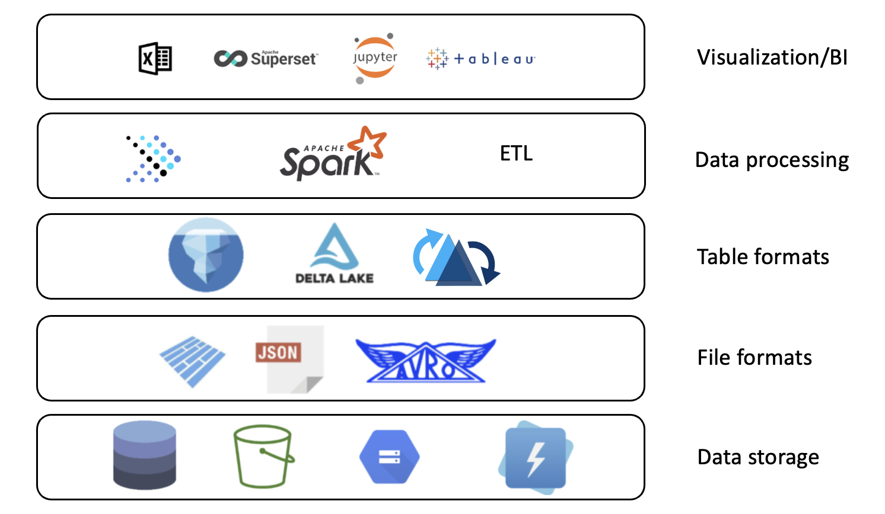
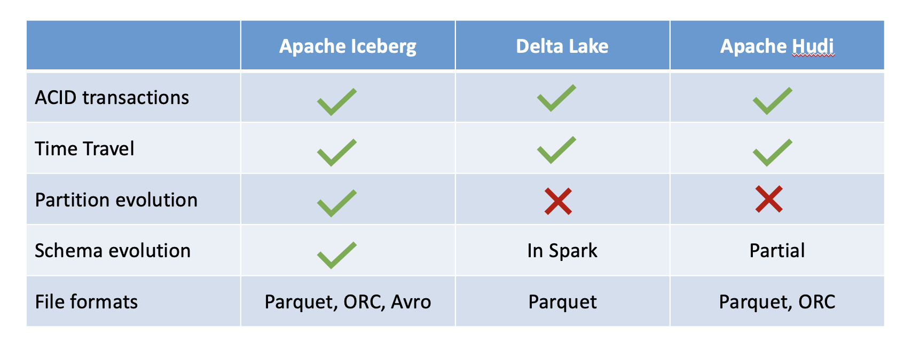
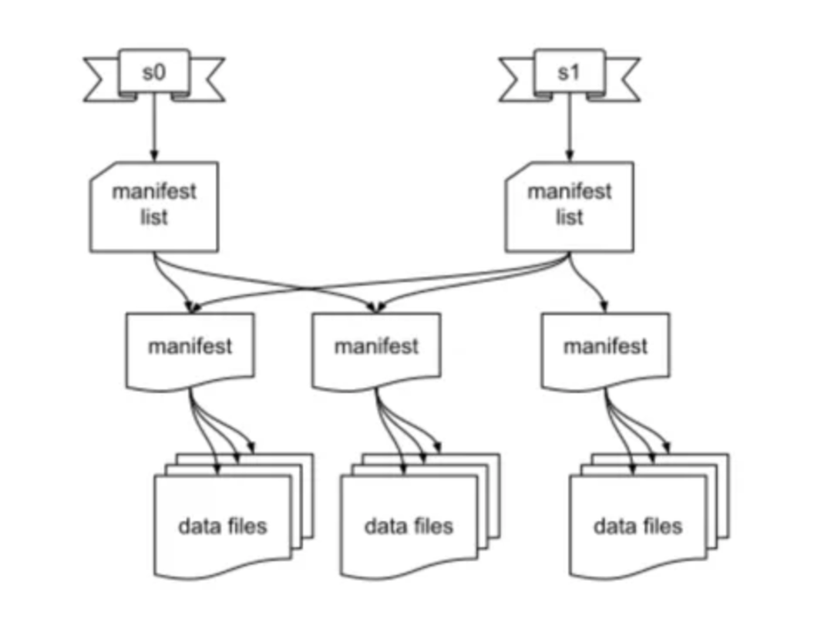

# Introduction

A data lakehouse is a data platform that merges the best aspects of data warehouses and data lakes into one data management solution. If you are looking for an open-source solution for a data lakehouse, Presto is the perfect choice. Presto is a fast and reliable SQL query engine for data analytics on the open lakehouse. It has a wide variety of use cases, like running interactive/ad hoc queries at sub-second performance for your high-volume apps, or lengthy ETL jobs that aggregate or join terabytes of data. Presto is designed to be adaptive, flexible, and extensible. The plugin mechanism it provides allows you to connect to different data sources. A single Presto query can combine data from multiple sources, archiving analytics across your entire organization. Dozens of connectors are available from the Presto community today. Here is a high-level architecture diagram:

## Data Lakehouses

In order to understand the data lakehouse, we should cover the other data storage solutions that it is based upon: the data warehouse and the data lake.

* Data warehouse: a storage system where relational (row- and column-based) tables are stored in order to perform fast analytics
* Data lake: a storage system where a great deal of semi-structured (XML, and JSON) or unstructured data (files, images, time-series, etc.) is stored as-is for a relatively low cost

A data lakehouse combines the query speed and data quality of a data warehouse with the flexibility and low storage cost of a data lake. An open lakehouse has the additional benefit of being based on open technologies. A general diagram of the architecture of a data lakehouse is below.

As seen in the above diagram, Presto and Apache Iceberg are open source projects that each have a place in the open data lakehouse. Let's look at where they fit in the ecosystem below.

## Presto Overview

Presto is a query engine, which is a piece of software that sits on top of the underlying data storage architecture and fulfills requests for data by optimizing the data retrieval process. More specifically, Presto is a *distributed* query engine for fast SQL-based analytics.

Presto is flexible and supports querying across diverse sources, including both structured relational databases and unstructured and semi-structured NoSQL data sources. Presto uses what it calls 'connectors' to integrate with this wide range of external data sources. Any data source can be queried as long as the data source adapts to the API expected by Presto. This makes Presto extremely flexible and extensible. Likewise, Presto supports many different file formats, such as ORC, Avro, Parquet, CSV, JSON, and more. Presto also supports a few different table formats including Delta Lake and Apache Iceberg.

Presto was open-sourced in 2019 when it was donated to the Linux Foundation and is under the open source governance of the Presto Foundation. All of these reasons make it the perfect choice of query engine for an open data lakehouse.

## Table Formats

In the above section, we mentioned that Presto supports multiple file formats and multiple table formats. Let's explore the meaning of these terms more closely. A file format is just the structure of a file that tells a program how to display its contents, as specified by the file extension. For example `.text` is a file format. In the case of a data lakehouse, there are a few different file formats that can be used to store table data. Some popular options are Avro, Parquet, and Orc.

A table format, on the other hand, is more like a metadata layer between the data file and the means by which it is accessed. A table format determines how the files that make up a table are organized and brings database-like features and efficiency to a data lake. In this way, it is a key part of a data lakehouse. Table formats support features that often aren't available on traditional data lakes, such as ACID transactions and row-level operations. The three most prevalent open table formats are Apache Iceberg, Apache Hudi, and Delta Lake. Take a look at the comparison table below:

### Apache Iceberg

Apache Iceberg is a popular table format because it is fast, efficient, and reliable at any scale. Iceberg simplifies data processing on the large datasets stored in data lakehouses due to its unique set of metadata that it stores for each table. Here is a diagram from the Apache Iceberg documentation that explains this metadata:

As we can see, table state is maintained using a series of files. The table metadata file tracks the table schema, partitioning config, and custom table properties - in other words, a snapshot of the table. More technically, a snapshot represents the state of a table at some time and is what is used to access the complete set of data files in the table.

The manifest list stores a list of the manifest files associated with the snapshot to which the manifest list applies, as well as some metadata about those manifest files. A manifest file points to a handful of data files that are associated with the manifest list, as well as additional metadata about those data files. Iceberg supports data files in Parquet, ORC, and Avro format.

Changes made to a table are efficient because a new metadata file is created and replaces the old metadata with an atomic swap.

## Getting Started

In this workshop, you will use docker to spin up

* A Presto cluster consisting of a single server node
* A Hive metastore server with a MySQL server as the underlying database
* A MinIO s3-compatible storage instance

Without further ado, let's get started.
