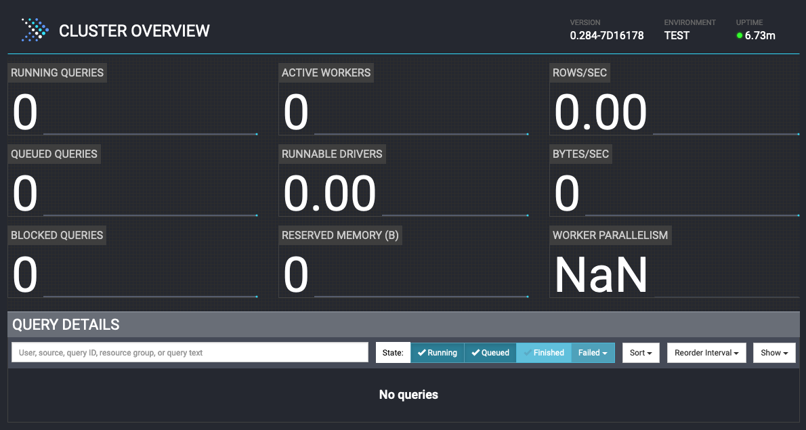
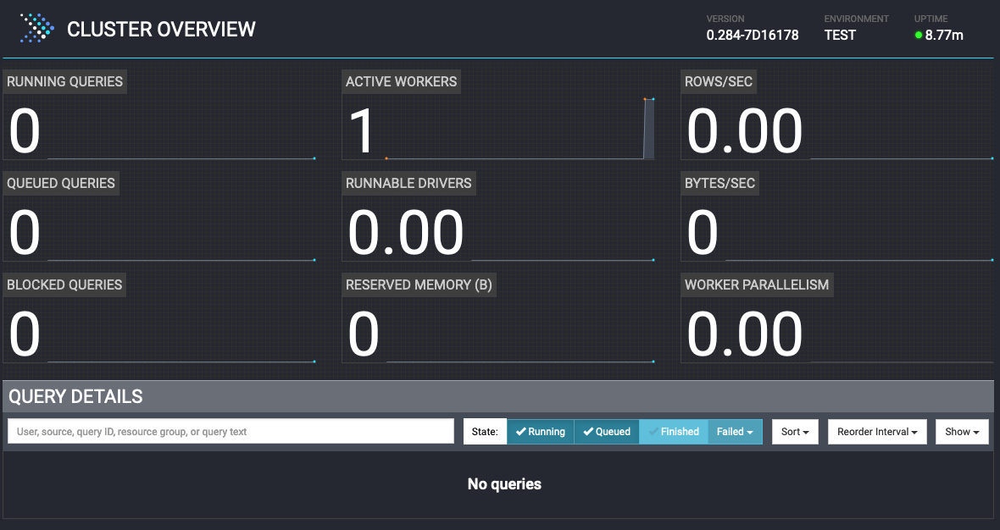
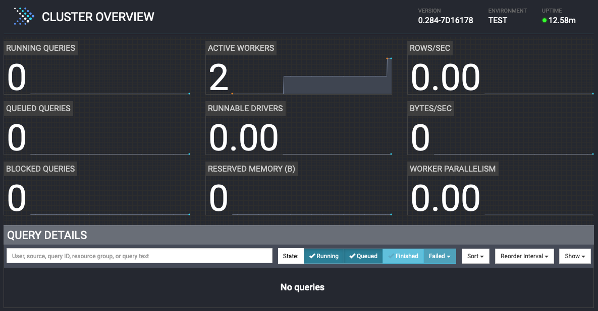
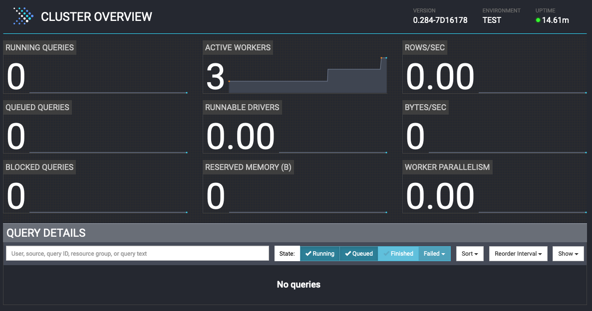

# Set up Presto

In this section, you will:
- Create a docker network to connect all containers that you are going to create
- Set up a Presto cluster including
  - A coordinator node
  - 3 workers node

This section is comprised of the following steps:

1. [Create a docker network](#1-create-docker-network)
2. [Create a Presto cluster](#2-set-up-presto-cluster) including:
   - [A coordinator node](#21-presto-coordinator)
   - 3 worker nodes
     - [worker1](#22-worker-node---worker1)
     - [worker2](#23-worker-node---worker2)
     - [worker3](#24-worker-node---worker3)
3. [Check Presto UI](#3-access-the-presto-ui-on-the-coordinator)

## 1. Create Docker Network
Create a docker network to be used by all of the containers, including the Presto cluster, MySQL, and MongoDB.

1. Open a terminal locally and run the following command:
   ```sh
   docker network create presto_network
   ```
2. Check the docker network named `presto_network` you just created:
   ```sh
   docker network inpsect presto_network
   ```
   You may see similar outputs like this:
   ```
   $ docker network inspect presto_network
   [
       {
           "Name": "presto_network",
           "Id": "d159756217770cb1230ee87e5006d2a63cd14b69d28eec6451856ead030ed870",
           "Created": "2023-11-09T11:39:23.874064549-08:00",
           "Scope": "local",
           "Driver": "bridge",
           "EnableIPv6": false,
           "IPAM": {
               "Driver": "default",
               "Options": {},
               "Config": [
                   {
                       "Subnet": "172.19.0.0/16",
                       "Gateway": "172.19.0.1"
                   }
               ]
           },
           "Internal": false,
           "Attachable": false,
           "Ingress": false,
           "ConfigFrom": {
               "Network": ""
           },
           "ConfigOnly": false,
           "Containers": {},
           "Options": {},
           "Labels": {}
       }
   ]
   ```

   This means you have created a docker network and it will be used by the Presto servers that we are going to create.

## 2. Set Up Presto Cluster

### 2.1 Presto Coordinator
Bring up a Presto server as a coordinator by using the following command:
```sh
docker run -d -p 8080:8080 -v ./conf/coordinator/config.properties:/opt/presto-server/etc/config.properties \
    -v ./conf/coordinator/jvm.config:/opt/presto-server/etc/jvm.config -v ./catalog:/opt/presto-server/etc/catalog \
    --net presto_network --name coordinator prestodb/presto:latest
```

This command starts a container named `coordinator` using the [prestodb/presto:latest](https://hub.docker.com/layers/prestodb/presto/latest/images/sha256-9663cb926599f6ceaef64cbc6a28226bab97abf7742e3d79c2bb3eeb34ea69ac) image with the `config.properties` and `jvm.config` configurations under the `config/coordinator` directory along with the catalog settings in the `./catalog` directory. For the catalog settings, we will cover that in the `lab-3``.

Here are the settings for the coordinator:
```text
coordinator=true
node-scheduler.include-coordinator=false
http-server.http.port=8080
discovery-server.enabled=true
discovery.uri=http://localhost:8080
```

- `coordinator` property defines if the Presto server acts as a coordinator or not. Use value `true` for a coordinator.
- `node-scheduler.include-coordinator` property defines if the Presto server acts as a worker as well as a coordinator. Use value `false`
    to not accept worker tasks.
- `http-server.http.port` property defines the port number for the HTTP server.
- `discovery-server.enabled` property defines if the Presto server acts as a discovery server to register workers.
- `discovery.uri` property defines the discovery server's URI which is itself for the coordinator.

You can use the following command to check the logs of the coordinator:
```sh
docker logs coordinator -f
```

If the Presto server is up and running properly, the last lines of the outputs would like the following:
```
2023-11-13T23:06:41.958Z        INFO    main    com.facebook.presto.storage.TempStorageManager  -- Loading temp storage local --
2023-11-13T23:06:41.963Z        INFO    main    com.facebook.presto.storage.TempStorageManager  -- Loaded temp storage local --
2023-11-13T23:06:41.989Z        INFO    main    com.facebook.presto.server.PrestoServer ======== SERVER STARTED ========
```

You can check the Presto UI by opening a browser with this URL: [http://localhost:8080](http://localhost:8080)

The page would look like this:



### 2.2 Worker Node - worker1
Start a worker node named `worker1` using the following command:
```sh
docker run -d -p 8081:8081 -v ./conf/worker1/config.properties:/opt/presto-server/etc/config.properties \
    -v ./conf/worker1/jvm.config:/opt/presto-server/etc/jvm.config -v ./catalog:/opt/presto-server/etc/catalog \
    --net presto_network --name worker1 prestodb/presto:latest
```

This command kicks off a worker node named `worker1` and uses the configurations under the `conf/worker1` directory with the following settings:

```
coordinator=false
http-server.http.port=8081
discovery.uri=http://coordinator:8080
```

- `coordinator` property is assigned the value of `false` for a worker node.
- `http-server.http.port` property defines the port number for the HTTP server. Since we are running a coordinator and 3 worker nodes on
    the local machine, need to use a different port for each node.
- `discovery.uri` property points to the discovery server on the coordinator.

You can use the following command to check the logs of the first worker node:
```sh
docker logs worker1 -f
```

If the worker node is up and running properly, the last lines of the outputs would like the following:
```
2023-11-14T04:03:22.246Z        INFO    main    com.facebook.presto.storage.TempStorageManager  -- Loading temp storage local --
2023-11-14T04:03:22.251Z        INFO    main    com.facebook.presto.storage.TempStorageManager  -- Loaded temp storage local --
2023-11-14T04:03:22.256Z        INFO    main    com.facebook.presto.server.PrestoServer ======== SERVER STARTED ========
```

Check the Presto UI again: [http://localhost:8080](http://localhost:8080). The number of active workers became `1`:


### 2.3 Worker Node - worker2
Start the second worker node named `worker2` using the following command:
```sh
docker run -d -p 8082:8082 -v ./conf/worker2/config.properties:/opt/presto-server/etc/config.properties \
    -v ./conf/worker2/jvm.config:/opt/presto-server/etc/jvm.config -v ./catalog:/opt/presto-server/etc/catalog \
    --net presto_network --name worker2 prestodb/presto:latest
```

This command kicks off a worker node named `worker2` and uses the configurations under the `conf/worker2` directory with the following settings:

```
coordinator=false
http-server.http.port=8082
discovery.uri=http://coordinator:8080
```

The settings are almost the same as `worker1, except for the port number:

- `http-server.http.port` property defines the port number for the HTTP server. Since we are running a coordinator and 3 worker nodes on
    the local machine, need to use a different port for each node.


You can use the following command to check the logs of the first worker node:
```sh
docker logs worker2 -f
```

Check the Presto UI again: [http://localhost:8080](http://localhost:8080). The number of active workers became `2`:


### 2.4 Worker Node - worker3
Start the third worker node named `worker3` using the following command:
```sh
docker run -d -p 8083:8083 -v ./conf/worker3/config.properties:/opt/presto-server/etc/config.properties \
    -v ./conf/worker3/jvm.config:/opt/presto-server/etc/jvm.config -v ./catalog:/opt/presto-server/etc/catalog \
    --net presto_network --name worker3 prestodb/presto:latest
```

This command kicks off a worker node named `worker3` and uses the configurations under the `conf/worker3` directory with the following settings:

```
coordinator=false
http-server.http.port=8083
discovery.uri=http://coordinator:8080
```

The settings are almost the same as `worker1` and `worker2`, except the port number:

- `http-server.http.port` property defines the port number for the HTTP server. Since we are running a coordinator and 3 worker nodes on
    the local machine, need to use a different port for each node.


You can use the following command to check the logs of the first worker node:
```sh
docker logs worker3 -f
```

## 3. Access the Presto UI on the Coordinator

You have successfully set up a Presto cluster with a coordinator and 3 worker nodes. Check the Presto UI again:
[http://localhost:8080](http://localhost:8080).  The number of active workers became `3`:


Well done! Let's move to the next lab to set up data sources.