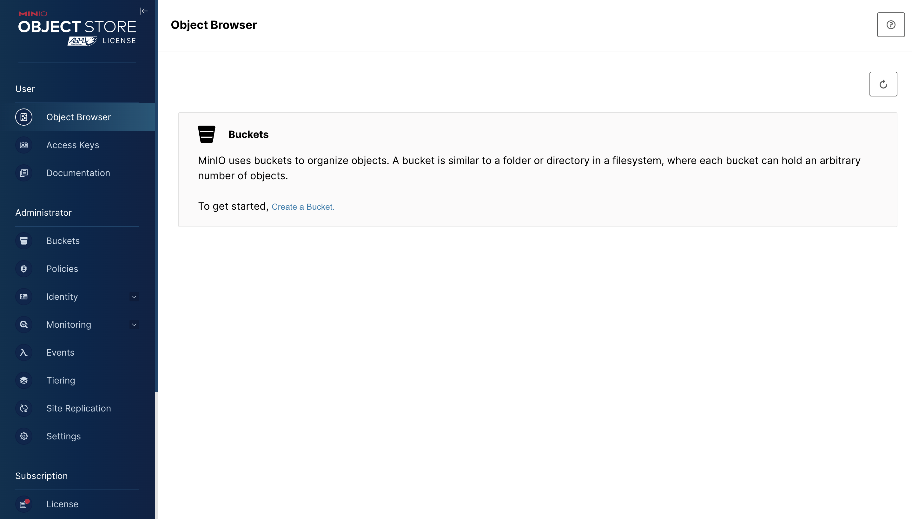

# Set up the Data Source

In this section, you will prepare the MinIO instance to use with Presto.

This section is comprised of the following steps:

- [Set up the Data Source](#set-up-the-data-source)
  - [1. Create a storage bucket](#1-create-a-storage-bucket)

## 1. Create a storage bucket

As we have already seen, MinIO will act as our underlying data storage for this workshop. MinIO is a high-performance, open-source object storage system. Because it implements the AWS s3 API (i.e., it is "s3-compatible"), we are able to use it to integrate with Presto. These types of object stores use buckets to organize files, giving us a specific location to provide to Presto when we read and write tables.

We'll create our bucket using the MinIO UI. Access the Minio UI in a browser at the relevant IP address: `http://<your_ip>:8443`. If you're running everything on your local machine, the address will be `http://localhost:8443`.

!!! note
    If you are using a remote Linux host, use the command `curl https://ipinfo.io/ip` to get your public IP address.

!!! note
    Recall that we assigned a port mapping of `8443:9091` in `docker-compose.yml`, meaning that within the Docker network, the MinIO UI exists on port 9091, but it is exposed on port 8443 when accessing it from outside of the container.

You will be prompted for a username and password, which are `minio` and `minio123` respectively, once again as defined in our `docker-compose.yml` for the `minio` service `environment` key. Once you are logged in, you will see a webpage like the below that indicates that there are no available bucket and prompts you to create one. Click "Create a Bucket".

Enter the name `test-bucket` and create the bucket. That's it! You can view the empty bucket in the "Object brower".

Now our s3 object store is ready for use. Let's move to the next section to start creating Iceberg tables in Presto.
