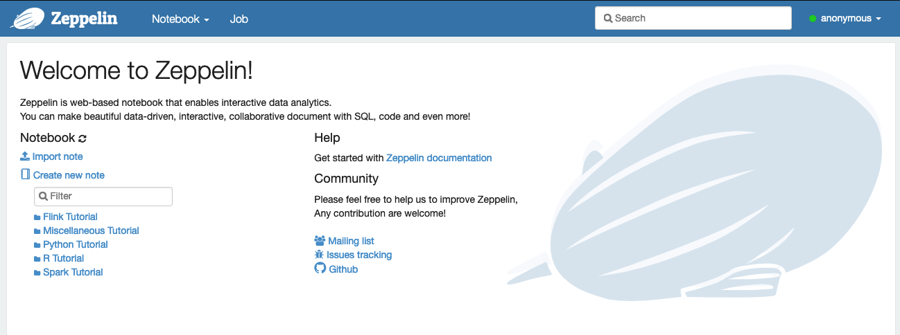
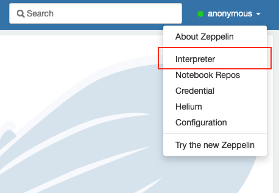
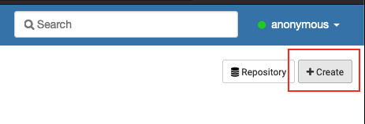
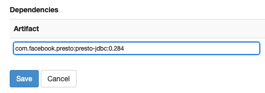
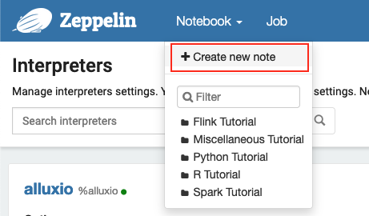
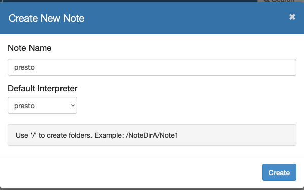
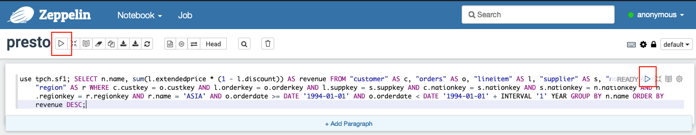
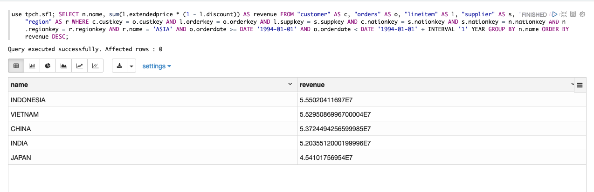
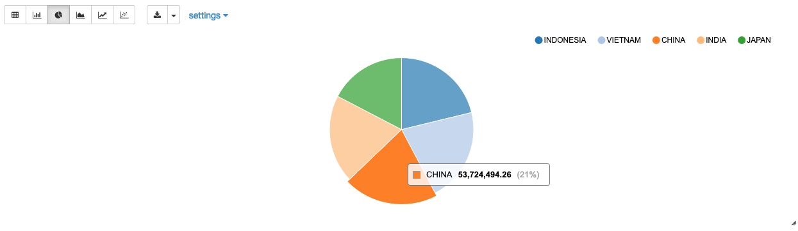

# Data Visualization

You've learned how to set up a Presto cluster, connect to multiple data sources, and run
federate queries. The main reasons that you can easily do these are:

- Presto provides many built-in data source connectors
- One single language: SQL
- Optimize performance for large-scale distributed workload

Also, because of these features, it becomes very easy to integrate a data visualization tool
with Presto. In this section, you will learn how to set up [Apache Zeppelin](https://zeppelin.apache.org/)
to connect to the Presto cluster and run data analytics and visualization.

This section is comprised of the following steps:

1. [Set up Apache Zeppelin](#1-set-up-apache-zeppelin)
1. [Data Visualization](#2-data-visualization)

## 1. Set up Apache Zeppelin

### Use the Offical Docker Image

Spin up an Apache Zeppelin container with the following command:
```sh
docker run -d -p 8443:8080 --name zeppelin --net presto_network apache/zeppelin:0.10.0
```

The command above starts up a container using the official Apache Zepplelin image and exposes
the dashboard on port 8443 of the host server.

You can use the following command to check the container logs:
```sh
docker logs -f zeppelin
```

You can access [http://localhost:8443](http://localhost:8443) on a browser to access the
dashboard, like this:



### Add Presto JDBC Driver

Thanks to the Presto JDBC Driver, you can easily integrate Apache Zeppelin with Presto.

1. Click on the `anonymous` in the upper-right corner and select `interpreter` on the pop-up
   menu:
   
     

1. Create a new interpreter by clicking the `Create` button under the `anonymous`:

     

1. Use **presto** for the `Interpreter Name`, meaning you need to use %presto as a directive
   on the first line of a paragraph in a zeppelin notebook. Then select **jdbc** as the
   `Interpreter group`:

     

1. Have the following settings in the `Properties` section:
     - `default.url`: **jdbc:presto://coordinator:8080/**
     - `default.user`: **zeppelin**
     - `default.driver`: **com.facebook.presto.jdbc.PrestoDriver**

     

1. Scroll down to the `Dependencies` section and use the maven URI to point to the Presto
   JDBC driver - **com.facebook.presto:presto-jdbc:0.284**. Click the `Save` button to
   save the settings.

     


You have created an interpreter to talk to the Presto cluster.

!!! note
    The interpreter connects the Presto without a specific catalog and schema. When using the
    `%presto` interpreter, you have to specify the catalog and schema in your SQL or run
    `use <catalog>.<schema>;` first.

## 2. Data Visualization

Apache Zeppelin is a web-based notebook that enables data-driven, interactive data analytics
and collaborative documents with SQL, Scala, Python, R and more. Here, we just show you
how easily to leverage Presto to run data analytics and visualization.

1. Create a Zeppelin note by clicking the `Notebook` on the top nav menu and select `Create new note`:

     

1. Name it as **presto** and select **presto** as the `Default Interpreter`. Click the `Create` button.

     

1. Copy and paste the following SQL to the first paragraph in the note:
   ```
   use tpch.sf1; SELECT n.name, sum(l.extendedprice * (1 - l.discount)) AS revenue FROM "customer" AS c, "orders" AS o, "lineitem" AS l, "supplier" AS s, "nation" AS n, "region" AS r WHERE c.custkey = o.custkey AND l.orderkey = o.orderkey AND l.suppkey = s.suppkey AND c.nationkey = s.nationkey AND s.nationkey = n.nationkey AND n.regionkey = r.regionkey AND r.name = 'ASIA' AND o.orderdate >= DATE '1994-01-01' AND o.orderdate < DATE '1994-01-01' + INTERVAL '1' YEAR GROUP BY n.name ORDER BY revenue DESC;
   ```

     Then click the `triangle` run button on the top menu bar or the upper-right corner of the first paragraph.

     

1. After the query finishes, the results will show up below the SQL.

     

1. You can select different built-in charts to visualize the results.

     